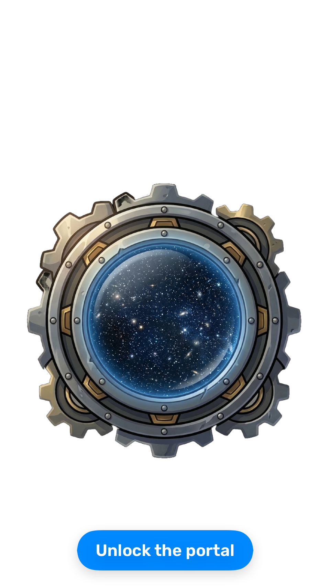
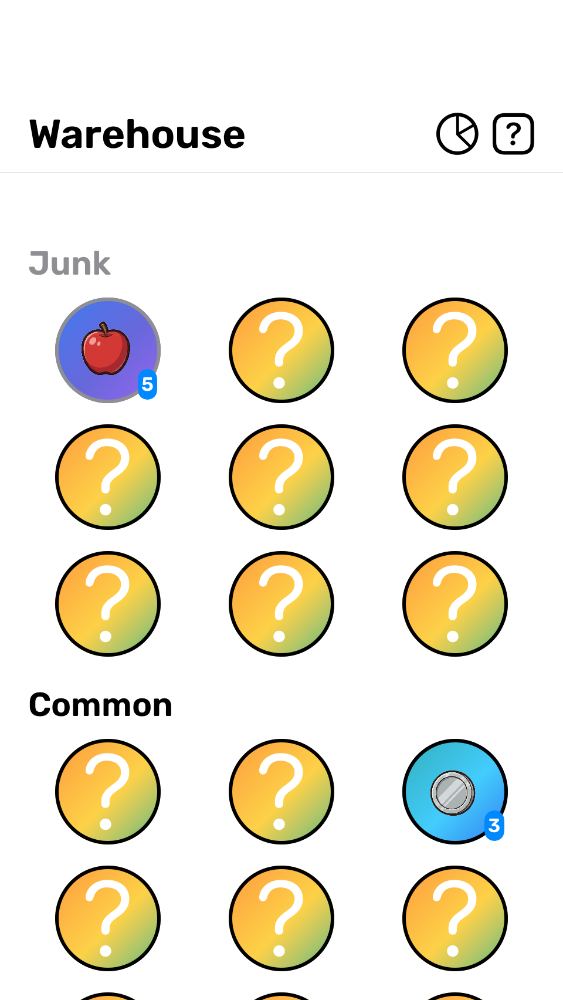
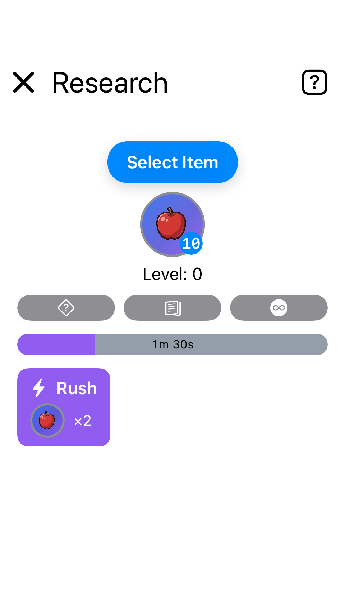
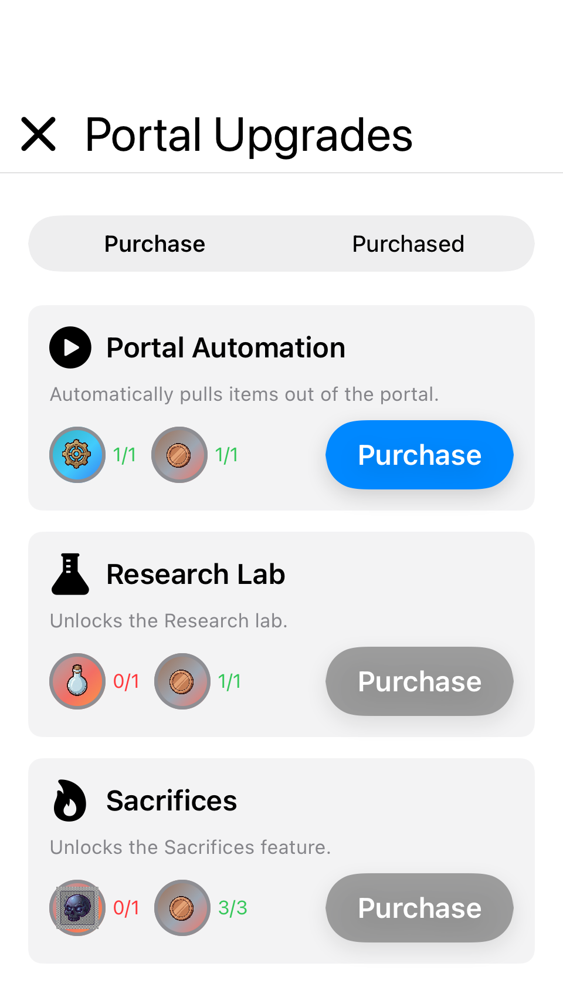
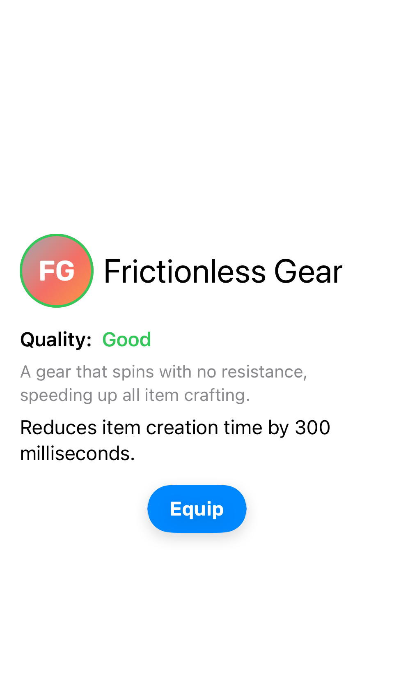
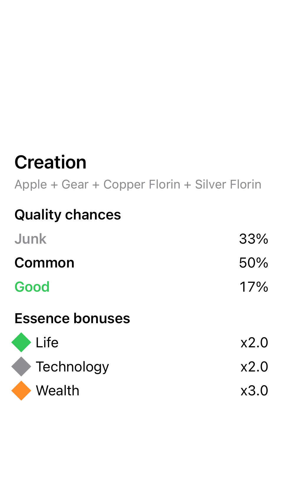

# Vesprium

A game about finding items from another dimension.

## Features

- **Research** — Research items to better understand the unknown dimension.
- **Portal** — Use the portal to pull items from another world.
- **Portal upgrades** — Spend items to upgrade the portal
- **Artifacts** — Find powerful artifacts to upgrade your.
- **Achievements** — Goals and progress with detail screens.
- **Encyclopedia** — Learn more about the game

## Platform & iOS version notes

- **Deployment target** — The main app target currently supports iOS 17 and later (as of 2026).
- **Metal swirl effect** — The `swirlEffect(radius:strength:)` view modifier in the design system uses SwiftUI's `distortionEffect` API, which is only available on **iOS 17+**.
  - The modifier is guarded with `@available(iOS 17, *)` and a runtime `#available` check, so it becomes a no-op on earlier iOS versions if the deployment target is ever lowered.
  - When changing the deployment target or adopting new SwiftUI/Metal features, keep this in mind so visual effects degrade gracefully on older OS versions.

## Example screens

|||
| ------------- | ------------- |
|   |   |
|   |   |
|   |   |

